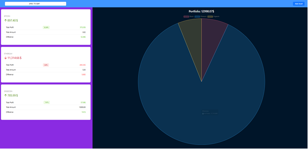
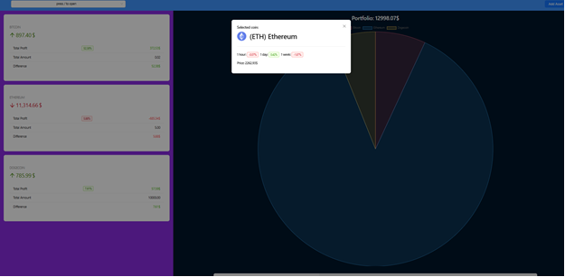
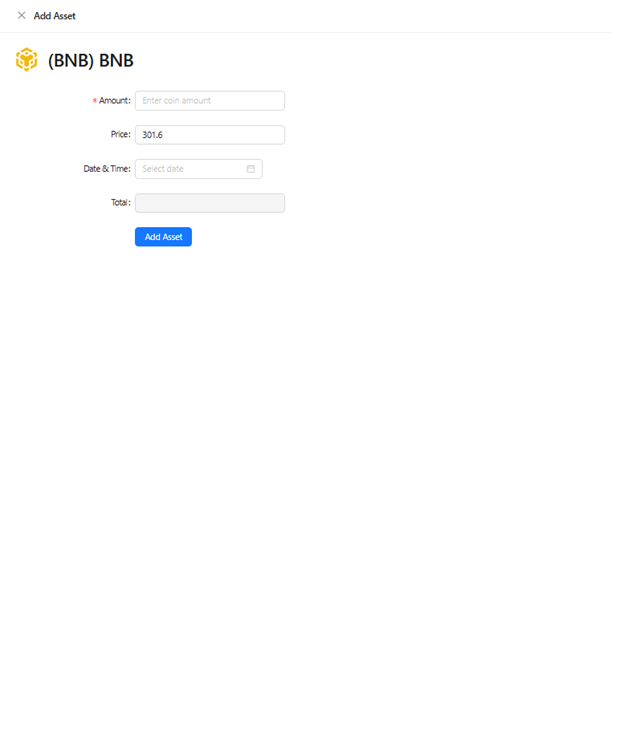

# CryptoPulse: Интеллектуальный трекер крипто-активов

Персональный дашборд для мониторинга криптовалютного портфеля в реальном времени. Приложение позволяет не только отслеживать текущие котировки, но и анализировать суммарную доходность личного кошелька с наглядной визуализацией прибыли и убытков.

## Скриншоты приложения

  | 

-----

## Технологический стек

  * **Frontend:** React, TypeScript.
  * **Система сборки:** Vite.
  * **State Management:** Redux Toolkit / RTK Query (для получения актуальных курсов с бирж и кеширования данных).
  * **UI Library:** Ant Design.
  * **Styling:** SCSS (BEM).
  * **Storage:** LocalStorage (для сохранения состава портфеля).

-----

## Ключевые особенности

### Мониторинг рынка

  * **Real-time обновление:** Отслеживание изменений стоимости популярных криптовалют через интеграцию с внешними API.
  * **Динамические индикаторы:** Цветовая индикация волатильности за последние 24 часа.

### Управление портфелем

  * **Персонализация:** Возможность добавлять монеты в личный кошелек с указанием их количества.
  * **Аналитика профита:** Автоматический расчет общей стоимости портфеля в реальном времени.
  * **Индикатор доходности:** Отображение абсолютного и процентного изменения баланса (P\&L) относительно вложенных средств.

### UX/UI

  * **Responsive Design:** Интерфейс полностью оптимизирован под мобильные устройства и десктопы.
  * **Persistence:** Данные о составе портфеля сохраняются в `localStorage`, что предотвращает их потерю при перезагрузке страницы.

-----

## Запуск проекта

### 1\. Подготовка

Убедитесь, что у вас установлены:

  * **Node.js** (версии 20 или выше)
  * **npm** или **yarn**

### 2\. Клонирование и установка

```bash
git clone https://github.com/your-username/crypto-wallet.git
cd crypto-wallet
npm install
```

### 3\. Запуск

```bash
npm run dev
```

-----

## План доработок

1.  **Интеграция графиков:** Добавление свечных графиков для детального анализа каждой монеты.
2.  **История транзакций:** Реализация лога добавления и удаления активов.
3.  **Поддержка мультивалютности:** Переключение отображения баланса между USD, EUR и RUB.
4.  **Unit-тесты:** Покрытие бизнес-логики расчета доходности тестами (Vitest).
5.  **Backend Integration:** Переход на PostgreSQL/Supabase для хранения данных пользователей.

-----

